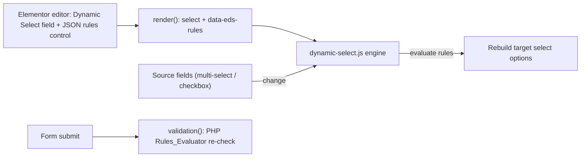

# Dynamic Select for Elementor Pro Forms

## Goal
A new Elementor Pro form field type, `dynamic_select`, configured per-field in the Elementor editor. The editor pastes/uploads a JSON ruleset on the field. On the frontend, JS watches the configured source fields (multi-select / checkbox), evaluates the rules (AND across fields + value matching), and rebuilds the target `<select>` options live. PHP re-evaluates the same rules on submit to prevent tampering.

## Decisions locked in
- New custom field type (not enhancing native select).
- Rules JSON managed per-field inside the Elementor editor.
- Matching runs client-side (full ruleset embedded per field).
- Source fields are multi-select/checkbox; conditions combine with AND.

## Architecture


## Plugin structure (new files)
- `elementor-dynamic-select.php` - plugin header, Elementor Pro active/version guard, admin notice, bootstrap.
- `includes/class-plugin.php` - singleton; registers field, registers/enqueues assets.
- `includes/fields/class-dynamic-select-field.php` - `extends \ElementorPro\Modules\Forms\Fields\Field_Base`.
- `includes/class-rules-schema.php` - normalize + validate ruleset JSON, collect errors.
- `includes/class-rules-evaluator.php` - shared evaluator (used by `validation()`); mirrors JS logic.
- `assets/js/dynamic-select.js` - frontend engine.
- `assets/js/editor-preview.js` - optional editor preview rendering.
- `assets/css/dynamic-select.css` - minimal styling.
- `schema/rules.schema.json` + `schema/example-rules.json` - documented JSON Schema + sample.
- `readme.txt` / `README.md` - install + JSON format docs.

## Field class key methods
- `get_type()` -> `dynamic_select`; `get_name()` -> "Dynamic Select".
- `update_controls( $widget )`: use the documented pattern to inject controls onto the `form_fields` repeater, each conditioned on `field_type => $this->get_type()`:
  - `eds_rules` - `Controls_Manager::CODE` (language `json`) to paste the ruleset (primary input).
  - `eds_rules_url` - optional `Controls_Manager::MEDIA`/`URL` fallback to load JSON from a file.
  - `eds_placeholder`, `eds_no_match_text` - UX text.
  - Native repeater already provides label, required, ID, etc.
- `render( $item, $item_index, $form )`: build a `<select>` via `add_render_attribute()` with:
  - name `form_fields[<id>]`, id `form-field-<id>`.
  - `data-eds-rules` = `esc_attr( wp_json_encode( normalized_rules ) )`.
  - `data-eds-sources` = list of source field IDs (inferred from rules if not declared).
  - a disabled placeholder option; starts empty/disabled until sources resolve.
- `get_script_depends()` / `get_style_depends()`: return the registered handles so assets load only when the field is used.
- `validation( $field, $record, $ajax_handler )`: read sibling source field values from `$record`, run `Rules_Evaluator`, and `add_error()` if the submitted value is not in the computed allowed set.

## Frontend engine (dynamic-select.js)
- For each `[data-eds-rules]` select: parse rules, resolve source field inputs by ID within the same form (`[name="form_fields[ID]"]` and `[]` variants for multi/checkbox).
- Bind `change`/`input` listeners on sources; on change gather each source's current value array.
- Evaluate rules in order; apply `behavior.match` (`first` wins vs `merge` unique-by-value); fall back to `default`.
- Rebuild `<option>`s, de-dupe by value, preserve current selection if still valid (`behavior.preserveSelection`), else reset; toggle disabled/placeholder + `noMatchText`.
- Re-run once on init to handle pre-filled/default source values.

## JSON ruleset format (scalable + reusable)
Reusable named `optionSets`, ordered `rules` with AND conditions, inline or referenced options, configurable `behavior`, and a `default`.
```json
{
  "version": 1,
  "behavior": { "match": "first", "preserveSelection": true, "emptyText": "Select an option", "noMatchText": "No options available" },
  "sources": ["country", "category"],
  "optionSets": {
    "euElectronics": [ { "value": "tv", "label": "Television" }, { "value": "phone", "label": "Phone" } ]
  },
  "rules": [
    { "id": "eu-electronics",
      "when": { "all": [
        { "field": "country", "operator": "includesAny", "value": ["de", "fr"] },
        { "field": "category", "operator": "includes", "value": "electronics" }
      ] },
      "use": "euElectronics" },
    { "id": "us-books",
      "when": { "all": [
        { "field": "country", "operator": "equals", "value": "us" },
        { "field": "category", "operator": "includes", "value": "books" }
      ] },
      "options": [ { "value": "fiction", "label": "Fiction" } ] }
  ],
  "default": { "use": null }
}
```
Supported operators (multi-value aware): `includes`, `includesAll`, `includesAny`/`intersects`, `equals` (set equality), `in`, `any` (non-empty). `when` supports `all` (AND, default) and `any` (OR) groups for future flexibility. `use` references an `optionSet`; `options` inlines them.

## Security & robustness
- Output: `esc_attr` + `wp_json_encode` for the embedded rules; escape all option labels/values on rebuild.
- Integrity: server-side `Rules_Evaluator` re-check in `validation()` so a tampered client can't submit disallowed values.
- Schema validation in `class-rules-schema.php`; invalid JSON renders a safe empty select and logs an editor-visible notice.

## Manual test
- Build a form with two multi-select/checkbox source fields + one Dynamic Select; paste the sample JSON; verify options update on change, selection preservation/reset, no-match text, and that submitting a forged value is rejected.